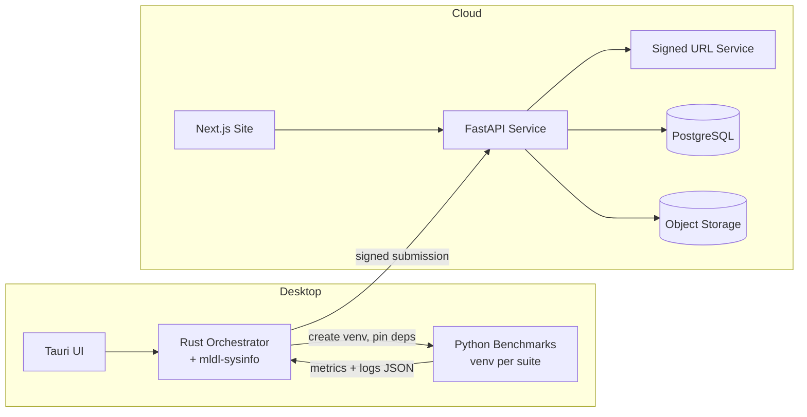

# mldl-bench — System Overview

**Status**: Draft for MVP

**Scope**: This document describes the end to end architecture, runtime flow, key components, data model highlights, and non functional requirements for the mldl-bench project. It reflects the current plan to ship a Tauri desktop app that orchestrates versioned Python benchmark suites and uploads results to a public leaderboard service. Docker based execution is planned for a later phase.

---

## 1. Goals

* Provide a simple desktop application for running standardised ML benchmarks on user devices.
* Collect full device and environment specs along with benchmark metrics and upload them to a central service.
* Publish a public leaderboard with strong filtering and version scoping, including a **confidence band** per result that reflects cohort variance for reproducibility clarity.
* Keep the desktop UI lightweight and cross platform friendly, with Linux support as a priority. Use **Tauri** for the shell and a Rust orchestrator for system tasks.
* Optimise for near zero infra cost for early users. Scale up later with caching and precomputed aggregates.
* Establish a first version of **trust tiering** and anti spam from day one so we do not need a breaking change later.
* Adopt **calendar versioning for suites** to keep comparability clear when data or parameters change. Use semantic versioning for the desktop app and API.
* Ship safe auto updates with the Tauri updater and **staged rollouts** for quick rollback.

---

## 2. High level architecture

**Primary path for MVP**

* **Desktop App**: Tauri UI (React or Svelte) with a Rust orchestrator. Uses a per suite virtual environment for local Python execution. Bundles an optional **embedded Python** fallback to reduce first run friction.
* **mldl-sysinfo crate**: Small Rust library for consistent hardware and driver detection across Windows, Linux, and macOS. Reusable later for the container runner.
* **Benchmark Suites**: Python tasks with pinned environments. Versioned using **calendar versions** like `2025.08.1` and immutable after release.
* **API Service**: FastAPI for result submission and leaderboard queries. Also serves **signed dataset URLs** to respect licensing, token rotation, and soft delete endpoints.
* **Database**: PostgreSQL for relational data. Object storage for logs and artifacts.
* **Website**: Next.js + Tailwind for leaderboards, profiles, device views, and confidence bands.
* **Updater channel**: Tauri updater reads GitHub Releases and supports **staged rollout** (1 percent to 100 percent) and quick rollback.

**Planned later**

* **Container runner**: Versioned Docker images per suite for stronger reproducibility. The desktop app will prefer the container path when Docker and GPU tooling are present.

---

## 3. Component details

### 3.1 Desktop app (Tauri)

* **UI**: Minimal shell to select and run a suite, show progress, and display results with confidence bands. Allows login for submission.
* **Rust orchestrator**:

  * **Hardware and drivers** via `mldl-sysinfo`: CPU, GPU, RAM, storage, OS, driver versions, CUDA availability.
  * **Environment setup**: Create `.mldl-venv` per suite version and install pinned dependencies. Optional fallback to **embedded Python** from python-build-standalone behind a feature flag.
  * **Dataset management**: Request **signed download URLs** from the API, verify checksums, cache locally. If a checksum fails, delete partial file and retry once.
  * **Runner**: Execute Python entrypoints. Capture stdout, stderr, timings, and peak memory. Capture optional perf counters.
  * **Submission**: Assemble a result manifest and sign it (ECDSA P-256) over code hash, dataset hash, env lock hash, and metrics.
  * **Offline mode**: Queue submissions when network is unavailable and retry with exponential backoff.
  * **Secrets**: Store submission tokens in the OS keyring. Fall back to an encrypted file if needed and support token rotation.
  * **Updater**: Use Tauri updater against GitHub Releases with staged rollout and rollback.

### 3.2 Benchmark suites (Python)

* **Structure**

  * `suite.yaml` metadata. Name, **calendar version** (for example `2025.08.1`), datasets, tasks, parameters, expected runtime window, metrics collected, and known variance notes.
  * `environment.lock.yml` for exact dependency pins.
  * `datasets/manifest.json` with source URLs, licenses, expected hashes, and sizes. Downloads occur through API issued signed URLs to respect licensing.
  * `tasks/*.py` entrypoints that emit structured JSON lines for metrics and optional perf counters.
* **Metrics captured**

  * Training time, inference latency, throughput, peak memory, CPU or GPU utilisation, dataset size scaling, CPU threads 1 vs N.
* **Determinism**

  * Fixed random seeds. Fixed thread counts. No direct network access during run except dataset fetch on first use via signed URLs. Document **known variance** sources such as BLAS, CUDA runtime, turbo boost, and NUMA.

### 3.3 API service (FastAPI)

* **Endpoints**

  * `POST /v1/runs` submit a signed result bundle. Requires auth.
  * `GET /v1/leaderboard` query by suite, version, task, metric, device type, CPU, GPU, RAM, OS.
  * `GET /v1/users/:handle` public profile and submitted runs.
  * `POST /v1/datasets/:id/url` return a short lived **signed URL** for dataset download.
  * `POST /v1/tokens/rotate` rotate a client submission token.
  * `DELETE /v1/runs/:id` soft delete a run. A purge job removes data after 30 days.
* **Validation**

  * Verify signature, suite version, environment lock, and dataset hash. Perform outlier and duplicate checks on insert. Compute cohort stats for confidence bands.
* **Auth and crypto**

  * Token based submission. Publish a JWKS at `/.well-known/jwks.json` for signature verification keys.

### 3.4 Data stores

* **PostgreSQL** for users, devices, benchmarks, runs, and metrics. Time partition by suite version for faster queries.
* **Object storage** for raw logs, profiling traces, and artifacts. Lifecycle policies move old logs to colder storage.

### 3.5 Website (Next.js)

* Server rendered pages for fast mobile loads.
* Leaderboards with filters and sort. Device pages and user profiles. Confidence bands and a **known variance** banner for native runs.

---

## 4. Data model summary

Tables and roles at a glance. Full schema lives in `docs/architecture/data-model.md`.

* `users`: id, handle, email hash, created\_at, flags, reputation.
* `devices`: id, user\_id, device\_type, CPU fields, GPU fields, RAM, storage, OS, drivers.
* `suites`: id, name, **calendar\_version**, eol\_date.
* `benchmarks`: id, suite\_id, name, dataset\_id, parameters\_hash.
* `datasets`: id, name, license, sizes, source\_url, integrity\_hash.
* `runs`: id, user\_id, device\_id, benchmark\_id, started\_at, finished\_at, signature, status, **git\_commit**, **perf\_counters JSONB**.
* `metrics`: run\_id, metric\_name, value, unit, stage, batch\_size, threads.
* `artifacts`: run\_id, storage\_key, hash, kind.

---

## 5. Versioning model

* **Suites** use **calendar versioning** like `YYYY.MM.n`. Any change to code, data, parameters, or environment pins creates a new version.
* Leaderboards default to the latest version per suite. Cross version comparison is allowed but marked as **not directly comparable**.
* **Desktop and API** use semantic versioning. Desktop supports safe auto updates with staged rollout and rollback.
* Deprecated suites remain queryable for history and can be auto hidden after `suites.eol_date`.

---

## 6. Validation and integrity

* **Client manifest** includes:

  * Hardware fingerprint. CPU id, GPU id, RAM summary, OS and driver versions.
  * Environment lock hash and dataset hash.
  * Benchmark code hash and parameters hash.
* **Signatures**

  * Use **ECDSA P-256** over the manifest to sign runs. Upload signatures as hex.
* **Server checks**

  * Signature verification and suite version check.
  * Cohort based outlier detection per device model and suite version. Compute a **confidence band** from cohort mean and stdev and expose it to the UI.
  * Duplicate detection per hardware fingerprint and time window.
* **Trust tiering (defined)**

  * A user is promoted from **new** to **trusted** for a given device and suite when they submit **3 successful runs** whose per metric **trimmed cohort z score** is within **±1.5** after removing the top and bottom **5 percent** of cohort values, and the coefficient of variation across their own 3 runs is **≤5 percent** for the primary metric.
  * If any later submission for that device and suite has **|z| ≥ 3** for the primary metric, the user is flagged **review** and the run is hidden pending inspection.
* **Licensing and datasets**

  * The client does not redistribute datasets. All downloads occur through short lived **signed URLs** issued by the API. This preserves license compliance and enables basic IP or referer checks.

---

## 7. Security and privacy

**Security controls**

* Enforce TLS 1.3 only. Add `X-Content-Type-Options: nosniff`, `Referrer-Policy: strict-origin-when-cross-origin`, and `Content-Security-Policy` suitable for the site and API.
* Use JWT for API auth. Rotate the signing key weekly. Publish a JWKS at `/.well-known/jwks.json` and cache it with a short TTL.
* Store submission tokens in the OS keyring. If unavailable, fall back to an encrypted file using age and a passphrase stored in the keyring.

**Privacy defaults (proposed)**

* Leaderboard shows results under a pseudonymous handle by default. Email is never displayed.
* Profile pages are private by default. Users can opt in to make profiles public. Public profiles show the handle, country or region if the user consents, and device summaries.
* Device specs that are shown: CPU model, GPU model, RAM capacity and speed, storage type, OS and driver versions. Never collect or store serial numbers, BIOS UUIDs, hostnames, or user file paths.
* Logs and artifacts are private by default. The UI offers a Share logs toggle when the user files a support ticket.
* Analytics and crash reporting are opt in. If enabled, send anonymised crash traces and basic performance counters.

**Data rights and retention**

* Users can delete individual runs from their profile. The API performs a soft delete and a purge job removes raw logs and artifacts after 30 days.
* Account deletion anonymises historical runs by removing the user mapping. Aggregated statistics remain, but no longer link to the user.
* Provide a self service export for a user to download their runs and profile data.

---

## 8. Performance and cost

**Performance plan**

* API: add read heavy indexes for leaderboard queries. Precompute aggregates nightly. Use HTTP caching with strong etags for GET endpoints. Return compressed JSON.
* Website: server side rendering and edge cache. Defer non critical scripts. Use responsive tables and compact charts for mobile.

**Cost guardrails**

* Object storage behind a CDN with a monthly budget alarm set at 20 USD. Enable caching and range requests for large artifacts.
* PostgreSQL on a small instance with pgbouncer. Enable auto stop after 30 minutes idle if supported by the provider.
* CI on GitHub Actions free tier. Cache Python and Node dependencies. Cache Docker layers with the gha backend when containers are introduced.

---

## 9. Observability

**SLOs**

| Metric                    | Target                | Notes                                   |
| ------------------------- | --------------------- | --------------------------------------- |
| API p95 latency           | < 350 ms              | per region, measured at the edge        |
| Submission success rate   | > 99 percent          | alert if under 95 percent for 5 minutes |
| Desktop crash rate        | < 0.5 percent per day | via Tauri crash reporter                |
| Cold start to first paint | < 800 ms              | measured with a custom tracing span     |

**Instrumentation**

* FastAPI middleware with Prometheus metrics and structured logs. Export to a lightweight time series store.
* Desktop: Sentry or similar for crash reporting, disabled by default and opt in at first run.
* Synthetic checks for the public API and the signed URL service.

---

## 10. Build and release

**Versioning discipline**

* Desktop and API follow semantic versioning. Even minor versions are stable releases. Odd minor versions are beta.
* Suites follow calendar versioning, for example `2025.08.1`.
* API path is pinned at `/v1`. Add `X-API-Deprecation` and `Sunset` headers at least 6 months before a breaking change.

**Installer and runtime prerequisites**

* Windows installer prompts: Install embedded Python runtime now. The checkbox is selected by default for first run success. Users can skip it and use a system Python.
* Minimum GPU driver policy: GPU tests require a driver whose vendor release date is not older than 12 months from the current date. The app fetches a vendor specific minimum version list from the API and blocks GPU tests when the local version is older, with a link to vendor update pages. Suites may also declare a minimum CUDA major version and minimum driver branch.

**Future container phase hooks**

* Publish empty OCI images that carry the suite label `org.mldl.suite=YYYY.MM.n` so the desktop can already list available suites by label.
* Keep runner logic behind a trait so the venv runner and container runner share the same interface.

---

## 11. Roadmap at a glance

* **MVP**

  * Tauri desktop with Rust orchestrator and optional embedded Python on Windows.
  * Python suite v1.0 with CPU tabular, XGBoost CPU, PyTorch ResNet small vision, and optional RAPIDS if CUDA is present.
  * FastAPI, Postgres, and public Next.js site.
  * Leaderboard shows confidence bands and known variance banners.
* **Dataset tiering policy**

  * Primary tier by VRAM buckets: `nogpu`, `vram_4`, `vram_8`, `vram_16plus`.
  * Optional upward adjustment by one tier when compute capability and memory bandwidth exceed suite thresholds. For example, compute capability 8.0 or higher and memory bandwidth over 400 GB per second.
  * Each run carries semantic tags for tier selection and device capabilities so filters can segment results cleanly.
* **Post MVP**

  * Container runner path. Tauri detects Docker and prefers the container execution when available.
  * Verified submitter program and stronger anti cheat.
  * More suites and datasets. Device price data for price to performance.
